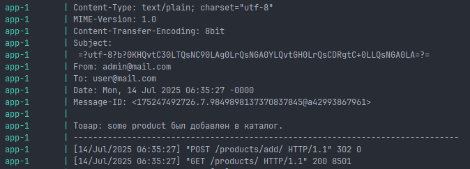

# Проект выполнен в рамках ДЗ "Django ORM"

В качестве БД использовался Postgresql. Для создания бд необходимо выполнить:

```shell
docker compose up -d db-store
```

После чего применить существующие миграции.

```shell
python manage.py migrate
```

В проекте присутствует .json файл с моковыми данными:

```shell
python manage.py loaddata ./store_app/fixtures/load_moc_data.json
```

# UDP Django и отложенные задачи с Celery и Redis//ДЗ

## Обновлен файл docker-compose.yaml: добавлены секции redis, celery.

### Запуск контейнера:

```shell
docker compose up --build db-store
```

после запуска контейнера ресурс доступен по ссылке: http://localhost:8000/

При запуске не в detached режиме и добавлении нового товара можно увидеть результат выполнения задачи.



